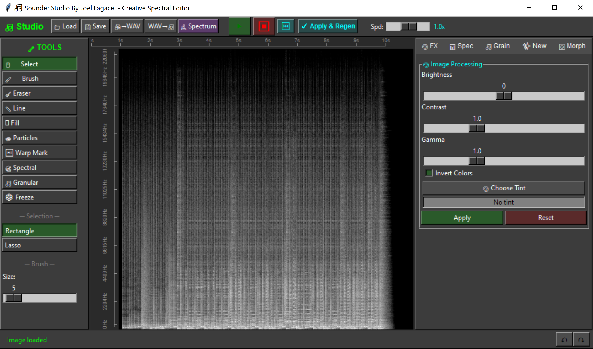
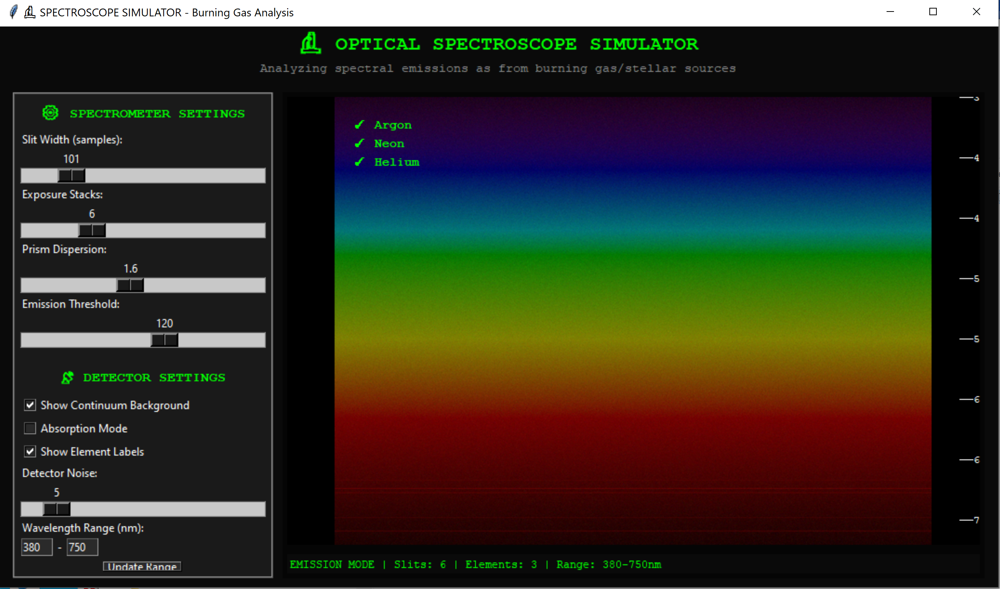

<div align="center">

# Sounder Studio

**Advanced Image-Based Audio Editor & Synthesizer**

[](#requirements)
[](LICENSE)
[](#requirements)

</div>


<br>


*Created by Joel Lagace*

Sounder Studio is a creative spectral manipulation tool that bridges the gap between visual art and sound design. By converting audio into visual spectrograms (and vice versa), it allows you to paint with sound, apply image filters to audio frequencies, and manipulate sonic textures using familiar image-editing tools.

## Features

### Visual Sound Editing

* **Familiar Tools:** Paint, erase, draw lines, and flood-fill directly onto the audio spectrum.
* **Image FX:** Apply brightness, contrast, gamma correction, and color inversions to sculpt frequencies.
* **Geometric Transforms:** Flip audio backward in time, invert frequencies, or apply selective bandpass/bandstop filters.

### Bi-Directional Conversion

* **WAV to Image:** Load any standard `.wav` file and translate it into a high-resolution grayscale spectrogram.
* **Image to WAV:** Regenerate playable, exportable audio from any image using the Griffin-Lim algorithm.

### Advanced Synthesis & FX

* **Granular Synthesis:** Turn visual selections into playable sound grains, scatter grains across the canvas, or generate dense grain clouds.
* **Spectral Freeze & Smear:** Freeze a specific column of time and smear it across your track.
* **Chaos & Glitch:** Inject colored noise (White, Pink, Blue), randomly scatter frequency blocks, and slice/glitch the audio timeline.
* **Time Warping:** Place custom warp markers to dynamically stretch and compress specific segments of audio.
* **State Morphing:** Save visual states and smoothly morph between different spectral snapshots.

### Optical Spectroscope Simulator

* Includes a built-in scientific spectroscope simulator.
* Treats the grayscale spectrogram as a light source (like burning gas or a star).
* Simulates passing light through a diffraction grating, complete with elemental emission/absorption line detection (Hydrogen, Helium, Sodium, etc.).

## Installation

### Prerequisites

Make sure you have Python 3.8 or higher installed on your system.

**Note on Audio Playback:** Live audio playback relies on the `sounddevice` library, which requires **PortAudio** to be installed on your system.

* **Windows:** PortAudio is usually included with the `sounddevice` pip wheel.
* **macOS:** `brew install portaudio`
* **Linux (Debian/Ubuntu):** `sudo apt-get install libportaudio2`

### Setup

1. Clone the repository:

```bash
git clone [https://github.com/yourusername/sounder-studio.git](https://github.com/yourusername/sounder-studio.git)
cd sounder-studio
```

2. Install the required Python dependencies:

```bash
pip install numpy scipy librosa soundfile Pillow sounddevice
```

3. Run the application:

```bash
python sounder_studio.py
```

## Basic Usage

1. **Load a File:** Click `WAV to Image` to load an existing audio file, or click `Load` to load any image file (PNG/JPG) to convert into sound.
2. **Edit:** Use the **Tools** panel on the left to paint or erase parts of the spectrum.
3. **Apply Effects:** Use the tabs on the right to apply Granular, Creative, or Morphing effects.
4. **Regenerate:** Click the **Apply & Regen** button in the top menu to permanently apply your visual changes and synthesize the new audio.
5. **Listen:** Press the **Play** button to hear your creation, adjusting the speed slider as needed.
6. **Export:** Click `Image to WAV` to save your synthesized audio back to a standard WAV file.

## Built With

* [Tkinter](https://docs.python.org/3/library/tkinter.html) - GUI Framework
* [Librosa](https://librosa.org/) - Audio and music processing
* [Pillow (PIL)](https://python-pillow.org/) - Image processing
* [Sounddevice](https://python-sounddevice.readthedocs.io/) - Live audio playback
* [NumPy](https://numpy.org/) & [SciPy](https://scipy.org/) - Array and signal mathematics


*If you make something cool with Sounder Studio, feel free to share it!*
